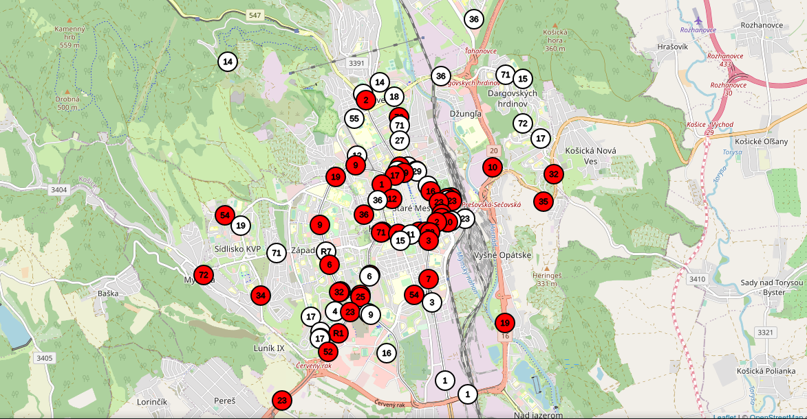

### App isn't fully finished, it may contain bugs
# DPMK Tracking

Using publicly accessible GPS to track buses and trams in my Košice, Slovakia.

## About

Simple python app built on Flask framework, that tracks buses and trams. GPS information is gathered from publicly open DPMK API.

App is inspired by https://mhdke.sk from NoLimit|DEVELOPERS, check them out on their [Facebook](https://www.facebook.com/101041385188593).

I built this app to learn Flask, JS and primarly [Leafletjs](https://leafletjs.com).

#### Proof of concept

